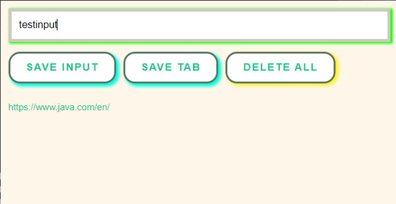

# Leads Tracker Chrome Extension

Chrome extensions are the programs that enhance user's Chrome Browser experience.
Sales teams spend countless hours tracking down their leads(potential clients or customers) or sourcing leads and they 
look for people online who are interested in their product and they keep saving the leads. So, the chrome extension that I will built wasa tool for these people online so that when they open any social media site(LinkedIn, Twitter,
Facebook, Github, etc.) they can track and save their leads.

## Technical details 

This project was made with HTML, CSS and JavaScript. Concepts of localStorage etc. are also used in it.

## The extension looks something like this 👇

If you open any website or webpage and click on <b>Save Tab</b> button, it is saved in the chrome extension as shown below.

Now, by mistake if you close the chrome browser, and again open it and open the extension, the saved tab still would appear on the extension as shown below

The input field in the extension can be used to type any input as follows:

When the <b>Save Input</b> button is clicked, the input in the text field is saved.

If you double click on <b>Delete All</b> button, the whole saved data is deleted.

